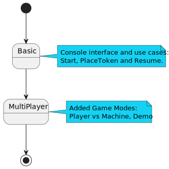
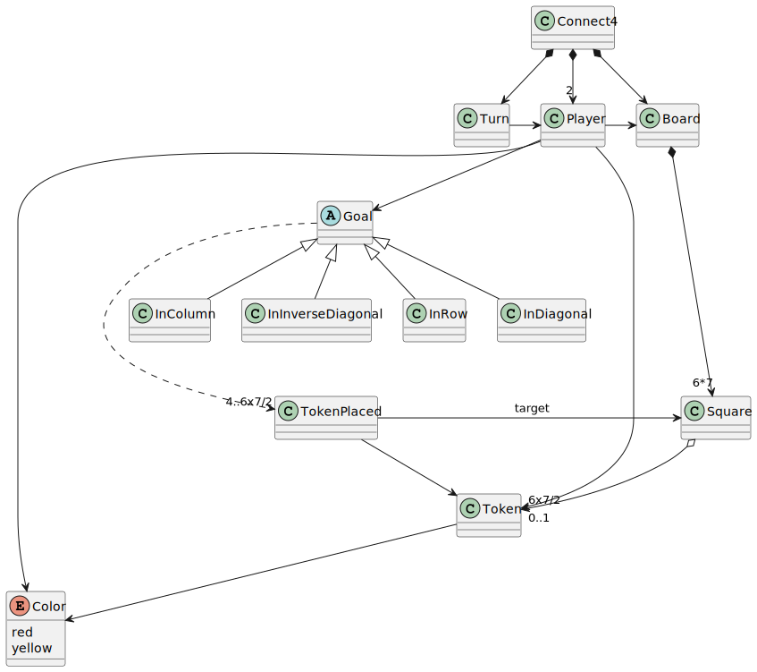
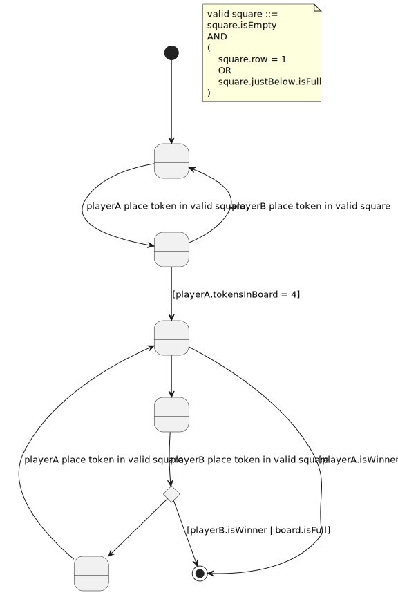
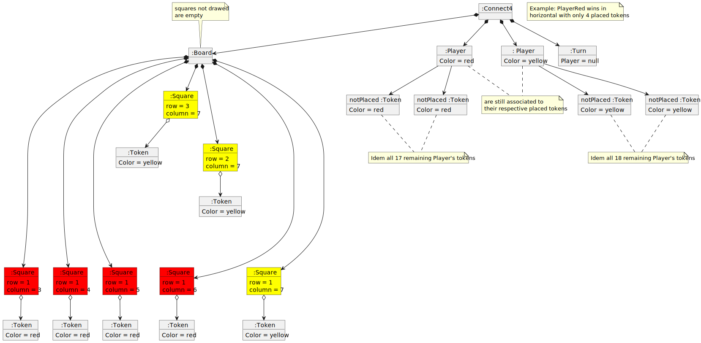

# Connect4
Project developed during [master of programming and software design](https://escuela.it/masters/master-programacion-diseno-software).

## Índex
* [Versions](#versions)
   * [Basic](#basic)
   * [Multiplayer](#multiplayer)
* [Develop resume](#develop-resume)
* [Domain Model](#domain-model)  
   * [Vocabulary](#vocabulary) 
   * [Instructions](#instructions)
   * [Initial State](#initial-state)
   * [Final State](#final-state)  
   

## Versions

### Basic 

[Basic Requisites](./docs/versions/basic/basic%20requisites.md)

### Multiplayer 

[Multiplayer Requisites](./docs/versions/multiplayer/multiplayer%20requisites.md)

## Develop resume

[Develop Resume](./docs/dev-resume/dev%20resume.md)

## Domain Model
  
  

[WIKI](https://es.wikipedia.org/wiki/Conecta_4)

[Youtube](https://www.youtube.com/watch?v=JBSbiilzg9U)

### Vocabulary

  

### Instructions 

### Initial State

### Final State  
  
