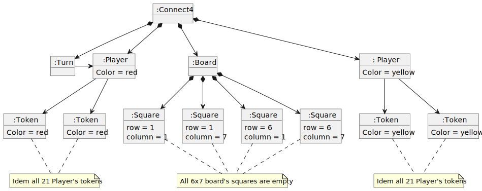
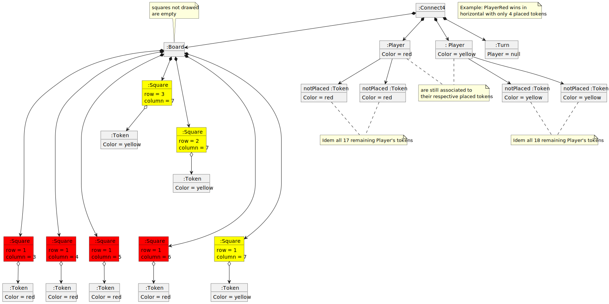
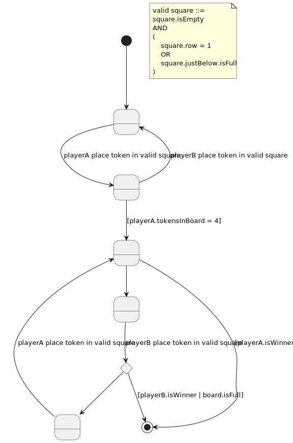
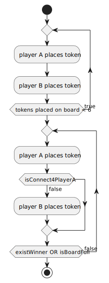

# Connect4
Project developed during [master of programming and software design](https://escuela.it/masters/master-programacion-diseno-software).

## index

* [domainModel](#domainModel)
    * [vocabulary](#vocabulary)
    * [initialState](#initialState)
    * [finalState](#finalState)
    * [instructions](#instructions)  

## domainModel

[WIKI](https://es.wikipedia.org/wiki/Conecta_4)

[Youtube](https://www.youtube.com/watch?v=JBSbiilzg9U)
### vocabulary

### initialState

### finalState

### instructions

  