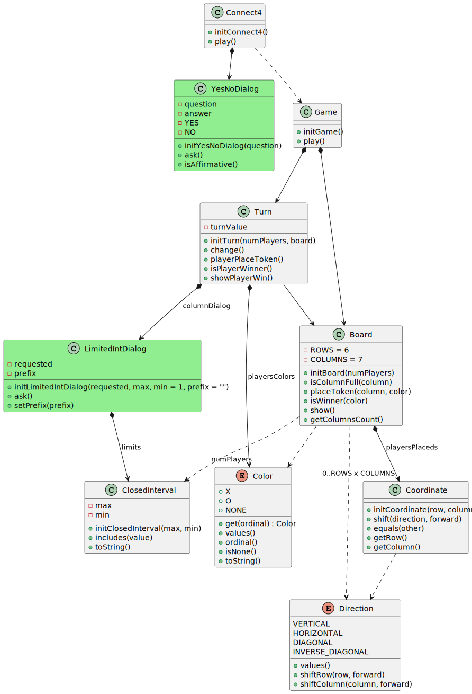

# Develop Resume

## Index
* [Intro](#intro)
* [Tasks - Branches](#tasks---branches)
    * [Task 0](#task-0-js_v00)
    * [Task 1](#task-1-js_v001)
    * [Task 2](#task-2-js_v02)

## Intro
This project has been used for practice:

1. Developement starts whith this knowledge:
    - JavaScript language: till how simulate classes with custom functions to init objects.
    - Dessing: till modular dessign (high cohesion, low coupling, low granurality) and Separate View Pattern.
2. Requisites and "expected level of code quality" evolves.
3. When something new is requested to be applied, that task is implemented in a new branch.
    - Obs: old branch remains, to make it easier future comparisions.

## Tasks - Branches
Task's description contains what's <i>new</i> vs previous task.

### Task 0: js_v0.0.0
- Task:
    - Implement vasic version.
        - Only with models        
- Basic version.
- Object Based Programing.
- Imperative programing.

### Task 1: js_v0.0.1
- Task: 
    - Uncouple models to in/out technologies.
    - Document-View architecture: views (presentation + logic) -> models (data)

### Task 2: js_v0.2
- Task:
    - Use constructor functions
    - Apply native js's methods from prorotypes (Array, Function, Object, wrappers, Set, Map ...) 
    - Apply statics   

### Task 3: js_v0.3
- Initial status:
    - App provided from teacher.
    - Added classes theory
    - Only models. There's no views.
- Task:
    - Create views. Uncouple models to in/out technologies.

