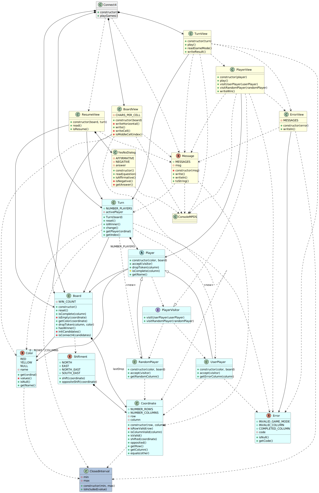

# Develop Resume

## Index
* [Intro](#intro)
* [Tasks - Branches](#tasks---branches)

## Intro
This project has been used for practice:

1. Developement starts whith this knowledge:
    - JavaScript language: till how simulate classes with custom functions to init objects.
    - Dessing: till modular dessign (high cohesion, low coupling, low granurality) and Separate View Pattern.
2. Requisites and "expected level of code quality" evolves.
3. When something new is requested to be applied, that task is implemented in a new branch.
    - Obs: old branch remains, to make it easier future comparisions.

## Tasks - Branches
Task's description contains what's <i>new</i> vs previous task.

