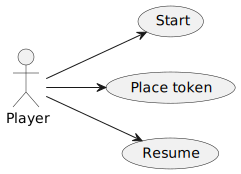

# Connect4. Basic requisites.
  
**Index**

1. [Requisites](#requisites)  
2. [Use Case View](#use-case-view)  
   2.1. [Start Use Case View](#start-use-case-view)  
   2.2. [Place Token Use Case View  ](#place-token-use-case-view)  
   2.3. [Resume Use Case View](#resume-use-case-view)  
   2.4. [Interface prototype](#interface-prototype)  

## Requisites  

 * Functionality: **Basic**  
 * Interface: **Console-Text**
 * Distribuction: **Standalone**
 * Persistence: **No**


## Use Case View  

| Actors and Use Case diagram | Context diagram |
|---|---|
|  |  |  

## Start Use Case View


## Place Token Use Case View  


## Resume Use Case View


### Interface prototype

```
--------- CONNECT4 ----------
 ___ ___ ___ ___ ___ ___ ___
|___|___|___|_O_|___|___|___|
|___|___|___|_X_|___|___|___|
|___|_X_|_O_|_O_|___|___|___|
|___|_O_|_X_|_X_|___|___|___|
|___|_O_|_O_|_X_|___|___|___|
|___|_O_|_O_|_X_|_X_|___|___| 

Player O choose column: 0
Wrong column: it must be [1, 7]

Player X choose column: 4
Wrong column: it's full

Player X won!!! ;-)
Do you want to continue? (y/n):

You have tied!!!
Do you want to continue? (y/n):

```